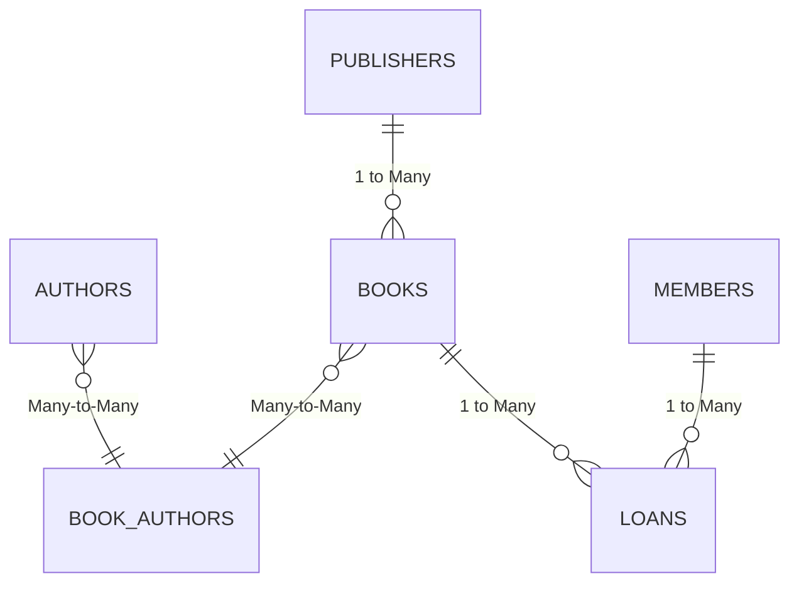

# 📚 LibraryMaster Pro Database 🏛️

## 🎯 Project Overview
A **full-featured MySQL database** for modern libraries, tracking books, members, loans, and more with industrial-strength data integrity!  

✨ **Key Features**:
- 📦 **Normalized schema** (3NF compliant)
- 🔐 **Bulletproof constraints** (PKs, FKs, CHECKs, UNIQUE)
- 📊 **Sample dataset** ready for demo
- ⚡ **Optimized for performance** (indexed columns)

## 🛠️ Setup in 10 Seconds Flat

```bash
# 1. Clone this repo
git clone https://github.com/yourusername/library-management-db.git

# 2. Deploy the database (MySQL required)
mysql -u root -p < library.sql
```

## 🗄️ Database Schema
### 📦 Core Tables
| Table          | Description                          |
|----------------|--------------------------------------|
| `books`        | All library holdings 📖              |
| `members`      | Registered patrons 👨👩👧👦         |
| `loans`        | Active book loans 🚀                |
| `authors`      | Literary creators ✍️                |
| `publishers`   | Publishing houses 🏢                |

### 🔗 Relationships


## 📸 ERD


## 💾 Sample Data Included
```sql
-- Real sample data from your library system
INSERT INTO books (title, isbn, publisher_id, available_copies) VALUES
('Pride and Prejudice', '9780141439518', 1, 3),  -- Jane Austen classic
('1984', '9780451524935', 2, 1),                 -- Orwell's dystopia
('Beloved', '9781400033416', 2, 4);               -- Toni Morrison masterpiece

INSERT INTO loans (book_id, member_id, status) VALUES
(1, 1, 'On Loan'),   -- John Smith has Austen
(2, 2, 'Returned');  -- Emily Johnson returned 1984

---
```

🔧 **Built with**: MySQL Workbench 8.0  
📜 **License**: MIT  
